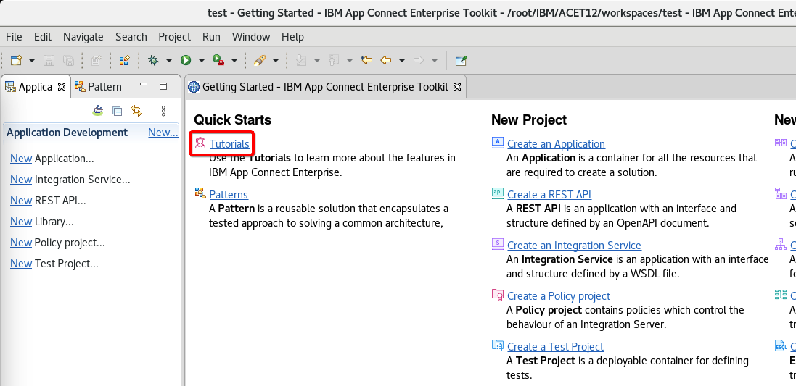
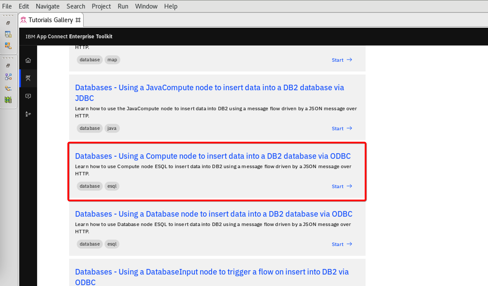
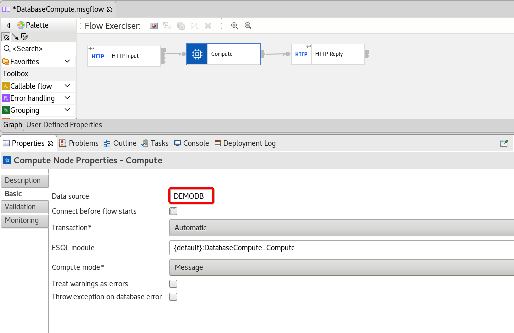
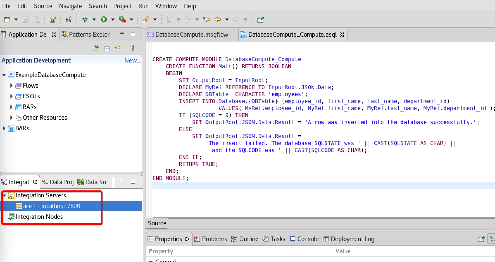
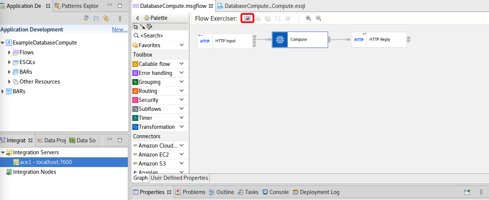
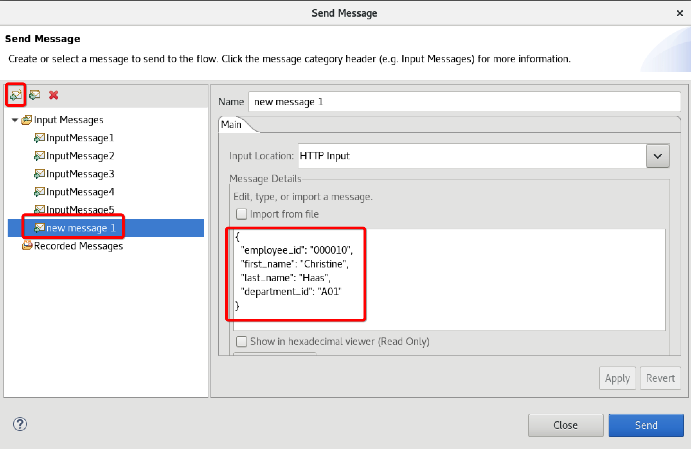
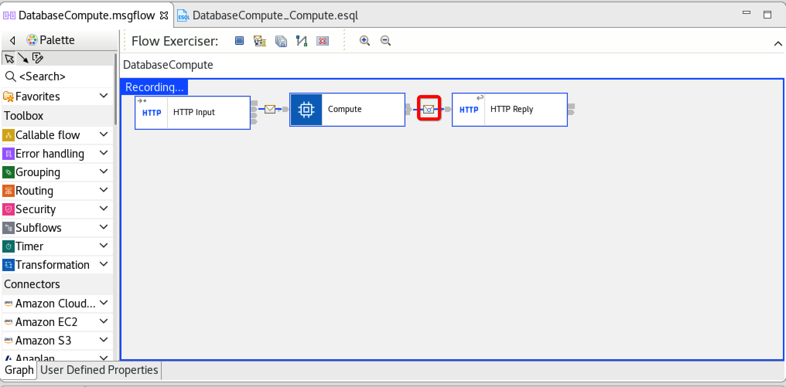
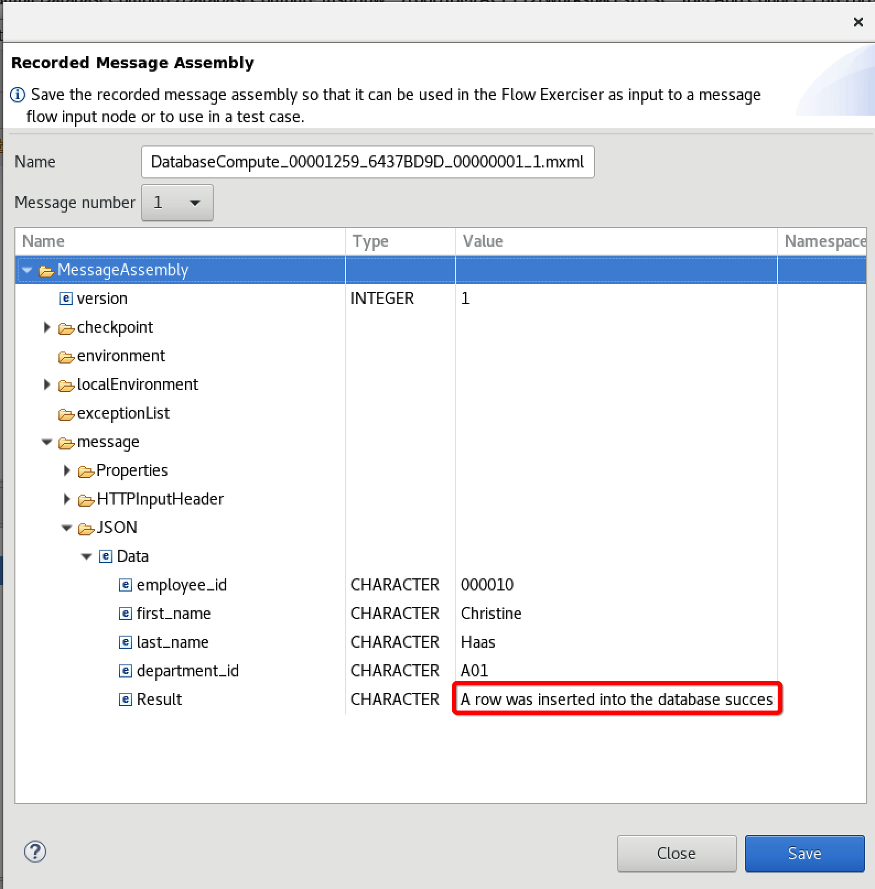

# Connecting from IBM App Connect Enterprise to PostgreSQL using ODBC on Linux

The example described in this blog was tested on CentOS 8. Similar steps can be performed on other Linux distributions. All commands are executed with *root* or *postgres* user identity.

## Install PostgreSQL

Go to https://postgresql.org. Click **Download**, select your Linux distribution, and provide version and platform details to generate the installation commands. The following commands were used in the described example:

Install package:
```sh
dnf install -y https://download.postgresql.org/pub/repos/yum/reporpms/EL-8-x86_64/pgdg-redhat-repo-latest.noarch.rpm
```

Disable the default module that comes with Linux (usually not the latest version):
```sh
dnf -qy module disable postgresql
```

Install Postgres server (version 15 in this case):
```sh
dnf install -y postgresql15-server
```

Run the initial setup. Enable and start the service:
```sh
/usr/pgsql-15/bin/postgresql-15-setup initdb
systemctl enable postgresql-15
systemctl start postgresql-15
```

Install additional libraries required for ODBC:
```sh
dnf install -y postgresql15-contrib
dnf install -y postgresql15-odbc
```

Set the password for the postgres user (automatically created during installation):
```sh
passwd postgres
```

## Create a sample database table

Switch to the *postgres* user:
```sh
su - postgres
```

Start the postgres shell:
```sh
psql
```

A prompt similar to the following appears, indicating that you are connected to the default database, also known as *postgres*:
```
postgres=#
```

The following commands can be used to list databases and check connection information:
```
\l
\conninfo
```

Create a simple table for testing. For example:
```sql
create table employees
(
  employee_id character varying(6),
  first_name character varying(20),
  last_name character varying(20),
  department_id character varying(3)
);
```

Verify that the table is created:
```
\dt
```

Exit the *postgres* shell:
```
\q
```

Switch back to the root user:
```sh
exit
```

## Install App Connect Enterprise

For simplicity, in this demo we will install ACE and run it as root on the same Linux machine.  Check the App Connect documentation for more installation instructions. 

Download (from Passport Advantage or Fix Central) and extract the installation package:
```sh
tar -xzvf 12.0-ACE-LINUXX64-12.0.8.0.tar.gz
```

In this case, the files were extracted in the root user's home directory:
```
/root/ace-12.0.8.0/
```

Accept the license:
```sh
/root/ace-12.0.8.0/ace make registry global accept license
```

Verify that a group named *mqbrkrs* is created:
```sh
cat /etc/group | grep mqbrkrs
```

## Set up an ODBC data source

After installation, the PostgreSQL libraries are available in the directory (here we assume version 15):
```
/usr/pgsql-15/lib/
```

You will find the following ODBC driver files:
```
psqlodbc.so
psqlodbca.so
psqlodbcw.so
```

Copy the driver to the App Connect Enterprise ODBC drivers directory:
```sh
cp /usr/pgsql-15/lib/psqlodbc.so /root/ace-12.0.8.0/server/ODBC/drivers/lib/.
```

App Connect Enterprise provides templates for the **odbc.ini** and **odbcinst.ini** files. Make a copy of these two files to a directory of your choice (in our case /root/demo/):
```sh
cp /root/ace-12.0.8.0/server/ODBC/unixodbc/odbc.ini /root/demo/odbc.ini
cp /root/ace-12.0.8.0/server/ODBC/unixodbc/odbcinst.ini /root/demo/odbcinst.ini
```

Set the group ownership of these two files to *mqbrkrs*:
```sh
chgrp mqbrkrs odbc.ini
chgrp mqbrkrs odbcinst.ini
```

Change the ini files. In our example below, the name of the ODBC data source is **DEMODB** and it points to a PostgreSQL server running on localhost. The database name and username are *postgres*:

**odbc.ini**
```ini
[ODBC Data Sources]
DEMODB=PostgreSQL ODBC datasource

[DEMODB]
Driver=/root/ace-12.0.8.0/server/ODBC/drivers/lib/psqlodbc.so
Description=Sample PostgreSQL DSN
Servername=localhost
Username=postgres
Database=postgres
ReadOnly=No
Servertype=postgres
Port=5432

[ODBC]
InstallDir=/root/ace-12.0.8.0/server/ODBC/drivers
UseCursorLib=0
IANAAppCodePage=4
UNICODE=UTF-8
```

**odbcinst.ini**
```ini
[ODBC]
;# To turn on ODBC trace set Trace=yes
Trace=no
TraceFile=/root/demo/odbctrace.out
Threading=2
```

Create an **ODBCINI** environment variable that points to the **odbc.ini** file and an **ODBCSYSINI** environment variable that points to the directory with **odbcinst.ini**:
```sh
export ODBCINI=/root/demo/odbc.ini
export ODBCSYSINI=/root/demo
```

Create a security identity for the user accessing PostgreSQL. Here we assume that the password for the *postgres* user is *Passw0rd* and that we are running on an independent integration server whose working directory is */root/demo/ace1* The directory must be created in advance using the *IntegrationServer* or *mqsicreateworkdir* commands:
```sh
mqsisetdbparms --work-dir /root/demo/ace1 -n odbc::DEMODB -u postgres -p Passw0rd
```

Test the connection with the **mqsicvp** tool:
```sh
mqsicvp --work-dir /root/demo/ace1 -n DEMODB
```

## Start the Integration Server

Prepare the environment:
```sh
. /root/ace-12.0.8.0/server/bin/mqsiprofile
```

If you haven't already done so, export the ODBC environment variables (unless you added them to the profile to make them persistent):
```sh
export ODBCINI=/root/demo/odbc.ini
export ODBCSYSINI=/root/demo
```

Start the server (assuming */root/demo/ace1* as the working directory):
```sh
IntegrationServer --name ace1 --work-dir /root/demo/ace1
```

## Start the Toolkit

Prepare the environment:
```sh
. /root/ace-12.0.8.0/server/bin/mqsiprofile
```

Start it:
```sh
/root/ace-12.0.8.0/ace toolkit
```

When prompted, select the workspace of your choice.

## Create and run a test flow

Create a simple test application and test flow. You can use the ***"Databases - Using Compute Node to Insert Data into a DB2 Database via ODBC"*** tutorial available in the **Toolkit Tutorials** as a template and adapt it for our Postgres example.





Set the data source for the compute node to the one we defined in **odbc.ini**:



Modify the ESQL code to match the name and structure of the Postgres table we created earlier. The code should look like this:

```sql
CREATE COMPUTE MODULE DatabaseCompute_Compute
  CREATE FUNCTION Main() RETURNS BOOLEAN
  BEGIN   
    SET OutputRoot = InputRoot;
    DECLARE MyRef REFERENCE TO InputRoot.JSON.Data;
    DECLARE DBTable  CHARACTER 'employees';
    INSERT INTO Database.{DBTable} (employee_id, first_name, last_name, department_id)
        VALUES( MyRef.employee_id, MyRef.first_name, MyRef.last_name, MyRef.department_id );
    IF (SQLCODE = 0) THEN
        SET OutputRoot.JSON.Data.Result = 'A row was inserted into the database successfully.';
    ELSE
        SET OutputRoot.JSON.Data.Result =  
          'The insert failed. The database SQLSTATE was ' || CAST(SQLSTATE AS CHAR) || 
          ' and the SQLCODE was ' || CAST(SQLCODE AS CHAR);             
    END IF;             
    RETURN TRUE;
  END;
END MODULE;
```

Connect to the Integration Server we started earlier:



Run the app with Flow Exerciser:



Create an input message (don't use the messages provided by the tutorial - they don't fit our case):



This is an example of a message that fits our definition of a database table (Christine Haas is probably the most commonly used name in IBM database examples):
```json
{
  "employee_id": "000010",
  "first_name": "Christine",
  "last_name": "Haas",
  "department_id": "A01"
}
```

Send a message. If everything is fine, the result will appear in the Exerciser:



Click the message icon to check the response from the Compute node:




